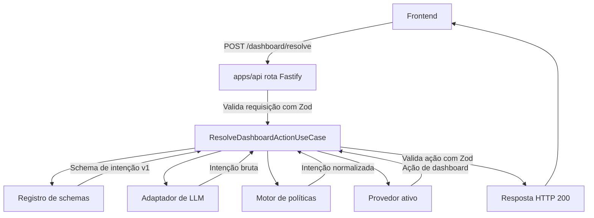
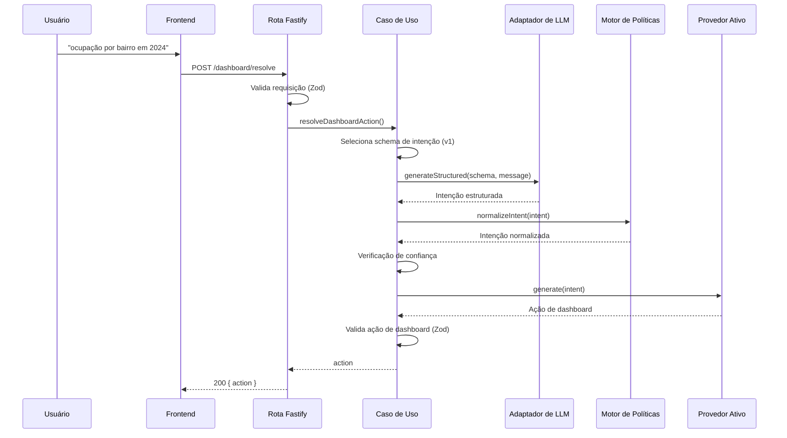
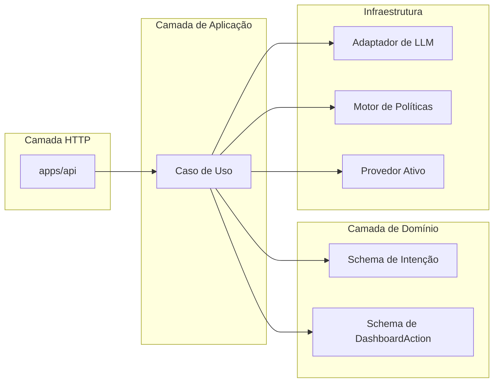
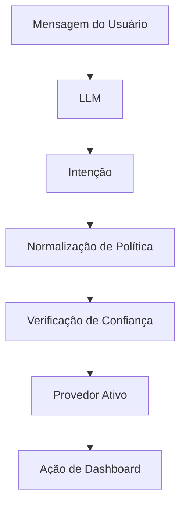
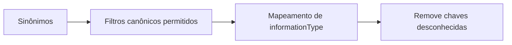
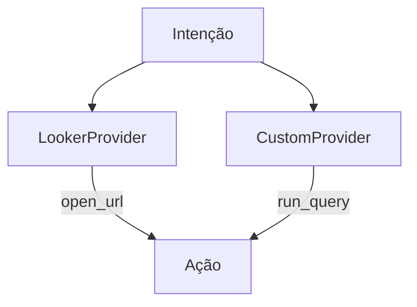
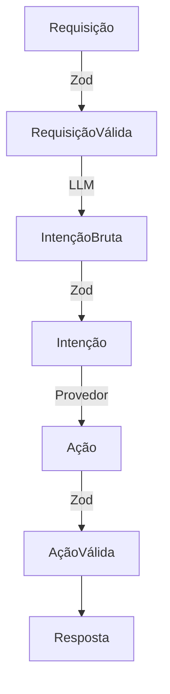
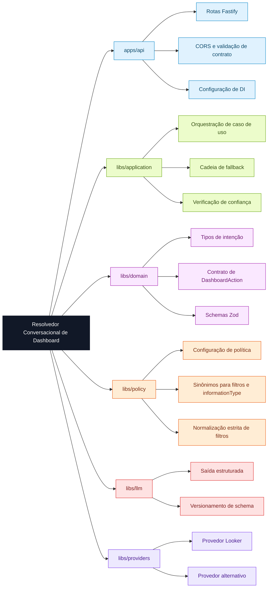

# Arquitetura

---

## Visão Geral da Arquitetura



---

# Fluxo Detalhado da Requisição



---

# Separação de Responsabilidades



---

# Transformação Central (Intenção → Ação)



---

# Política (estrita por padrão)



---

# Troca de Provedor (sem mudar o domínio)



⚠️ Apenas **um provedor ativo por vez**, selecionado no `apps/api/config/policy.ts` pela chave `activeProvider`:

```
"activeProvider": "looker"
```

ou

```
"activeProvider": "custom"
```

---

# Validação em Todas as Fronteiras



---

# Mapa Mental Resumido



---

# Conceito Central da Arquitetura

> O LLM sugere a intenção.
> A política normaliza de forma estrita.
> O provedor materializa a ação.
> O domínio garante o contrato.
