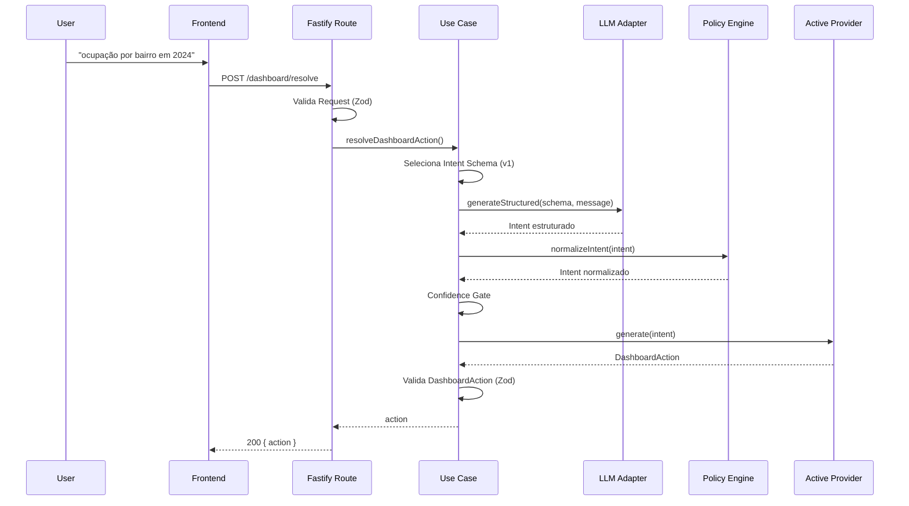
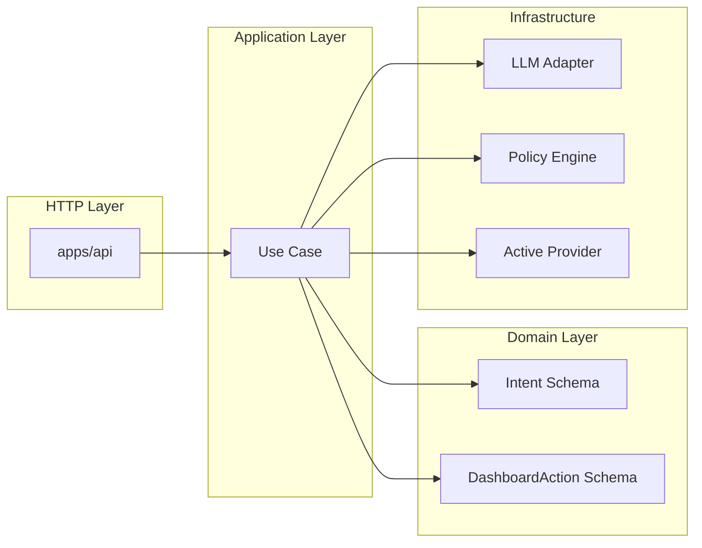
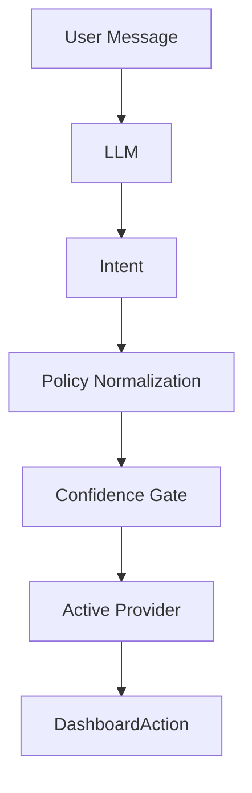
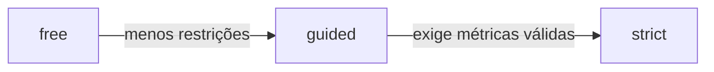
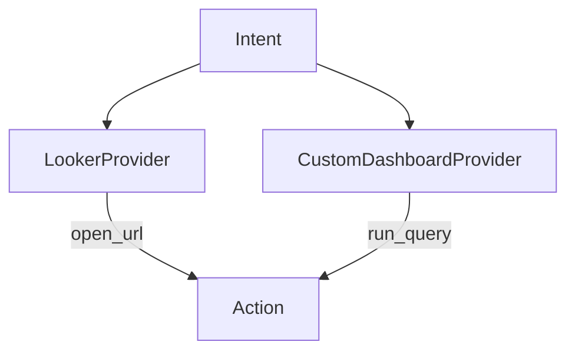
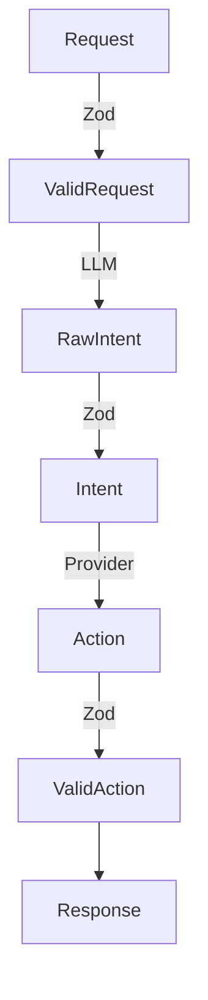
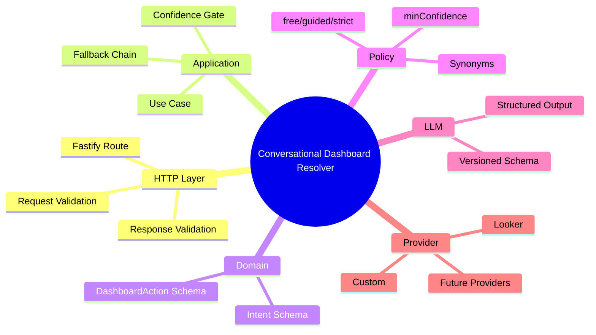

# 🏗️ Arquitetura

---

## 📐 Visão Geral da Arquitetura

```mermaid
flowchart TD

A[Frontend] -->|POST /dashboard/resolve| B[apps/api - Fastify Route]

B -->|Valida Request (Zod)| C[ResolveDashboardActionUseCase]

C --> D[Schema Registry]
C --> E[LLM Adapter]
C --> F[Policy Engine]
C --> G[Active Provider]

E -->|Raw Intent| C
D -->|Intent Schema v1| C
F -->|Normalized Intent| C
G -->|DashboardAction| C

C -->|Valida DashboardAction (Zod)| H[HTTP Response 200]

H --> A
```

---

# 🔄 Fluxo Detalhado da Requisição



---

# 🧠 Separação de Responsabilidades



---

# 🔁 Transformação Central (Intent → Action)



---

# 🎛️ Progressive Hardening (Modo da Policy)



---

# 🔌 Troca de Provider (sem mudar o domínio)



⚠️ Apenas **um provider ativo por vez**, selecionado por config:

```
ACTIVE_PROVIDER=looker
```

ou

```
ACTIVE_PROVIDER=customDashboard
```

---

# 🛡️ Validação em Todas as Fronteiras



---

# 🧭 Mapa Mental Resumido



---

# 🎯 Conceito Central da Arquitetura

> O LLM sugere a intenção.
> A Policy controla o rigor.
> O Provider materializa a ação.
> O Domain garante o contrato.
