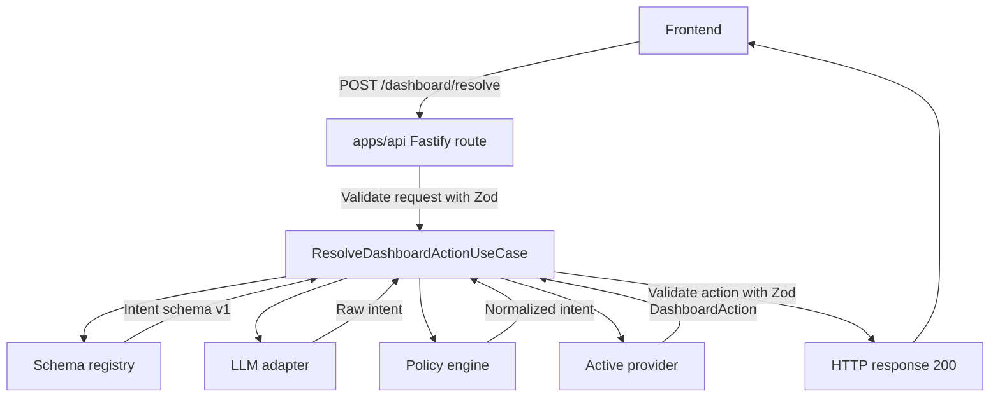
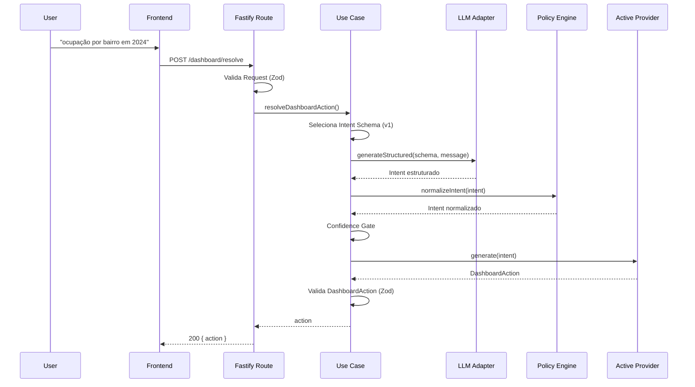
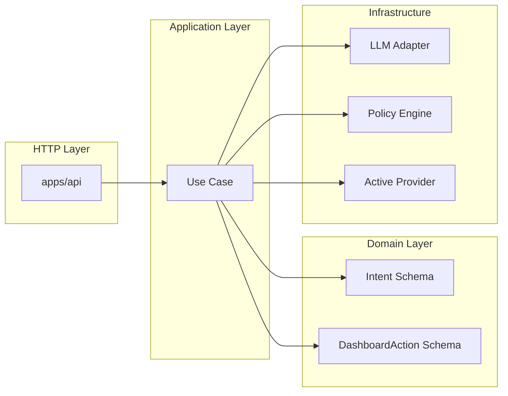
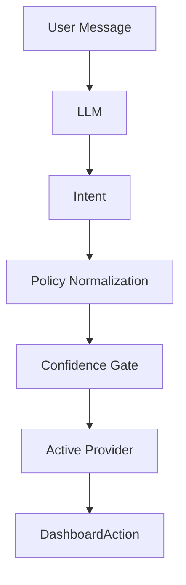
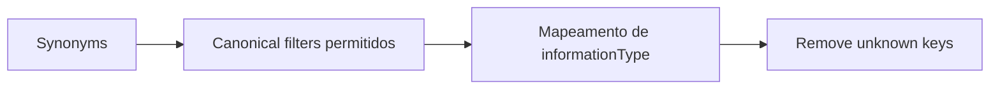
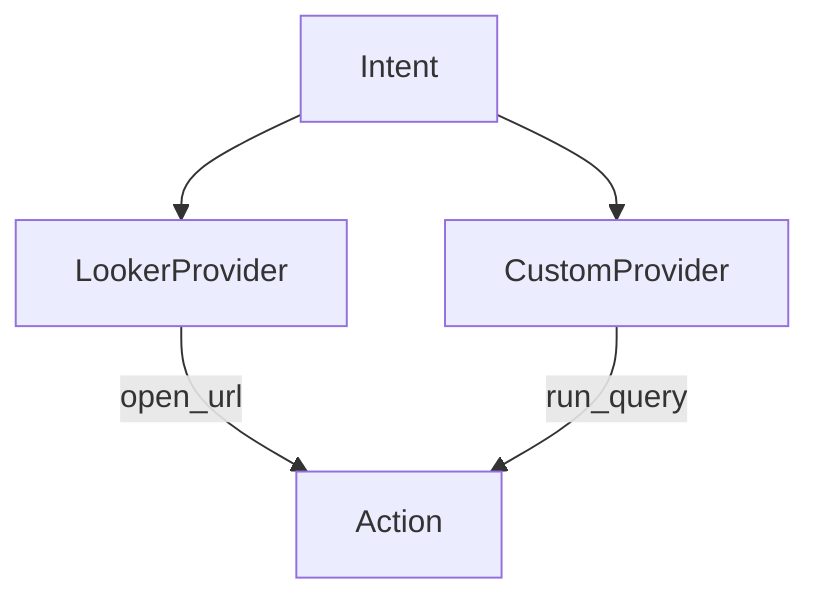
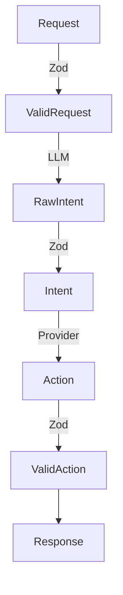
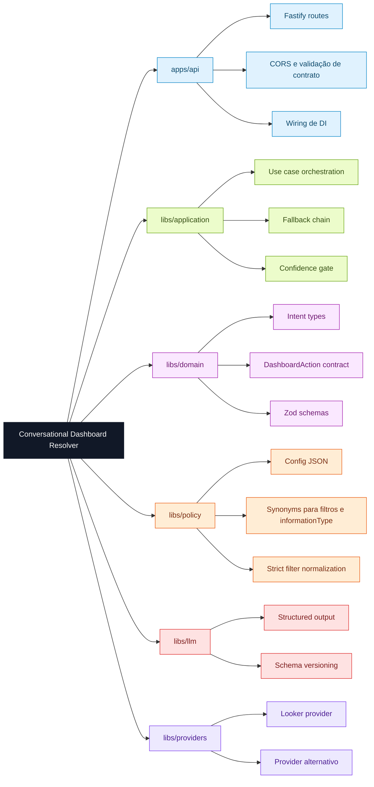

# 🏗️ Arquitetura

---

## 📐 Visão Geral da Arquitetura



---

# 🔄 Fluxo Detalhado da Requisição



---

# 🧠 Separação de Responsabilidades



---

# 🔁 Transformação Central (Intent → Action)



---

# 🎛️ Policy (estrita por padrão)



---

# 🔌 Troca de Provider (sem mudar o domínio)



⚠️ Apenas **um provider ativo por vez**, selecionado no `policy.json` pela chave `activeProvider`:

```
"activeProvider": "looker"
```

ou

```
"activeProvider": "custom"
```

---

# 🛡️ Validação em Todas as Fronteiras



---

# 🧭 Mapa Mental Resumido



---

# 🎯 Conceito Central da Arquitetura

> O LLM sugere a intenção.
> A Policy normaliza de forma estrita.
> O Provider materializa a ação.
> O Domain garante o contrato.
